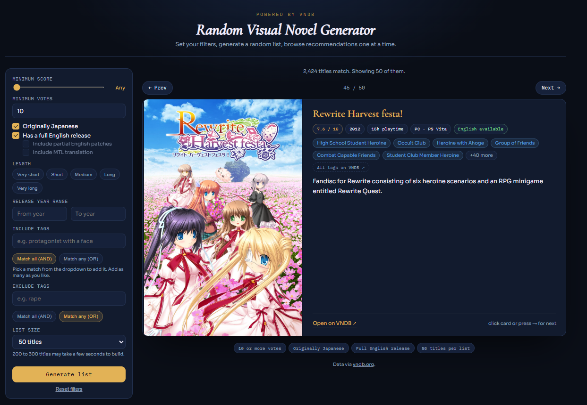

# vnpicker

A random visual novel generator and browser built on the [VNDB](https://vndb.org) API. Set filters, generate a randomized list of matching titles, and browse the results one at a time with cover art, stats, tags, and a synopsis.

**Live demo:** https://kamin1ii.github.io/Random-Visual-Novel-Generator/

Static site, no build step, no framework. Vanilla HTML, CSS, and ES modules.



## Features

- Filter by minimum score, minimum vote count, and release year range
- Filter by original language (Japanese) and English release status, including partial patches and machine translations
- Filter by playtime length
- Include and exclude specific VNDB tags, each with independent AND/OR match modes, using a debounced autocomplete search against the VNDB tag database
- Generates a randomized list (50 to 300 titles) from all matching results, with a new random subset and browsing order on every generate
- Browse one title at a time by clicking the card, using the Prev/Next buttons, or the left/right arrow keys
- Cover art preloads for nearby entries in the list so navigation feels instant
- Sensitive cover art is blurred by default with a click-to-reveal option
- Content tags are capped to a short preview per title with an option to expand the rest in place, plus a link to the full tag list on VNDB for anything filtered out of that preview
- Responsive layout for narrower screens

## Requirements

A modern browser. No dependencies, no package manager, no build tooling.

Because the app is loaded as ES modules (`<script type="module">`), it needs to be served over `http://` rather than opened directly as a `file://` URL, or module imports will be blocked by the browser.

## Running locally

From the project root, serve the directory with any static file server, for example:

```
python -m http.server 8000
```

Then open `http://localhost:8000` in a browser.

## Project structure

```
vnpicker/
├── index.html
├── css/
│   ├── base.css          global resets, fonts, masthead
│   ├── layout.css        page grid, sidebar, card layout
│   ├── components.css    inputs, chips, buttons, card contents
│   └── responsive.css    narrow-viewport overrides
└── js/
    ├── main.js           entry point, event wiring
    ├── state.js           shared app state
    ├── dom.js             cached element references
    ├── constants.js        VNDB API config and lookup tables
    ├── api.js              VNDB query building and pagination
    ├── filters.js          UI filters to VNDB query filters
    ├── tagPicker.js         tag search/autocomplete component
    ├── render.js            renders the current VN to the card
    └── coverImage.js        cover image preloading and load states
```

## Data and attribution

All visual novel data (titles, cover art, tags, ratings, and related metadata) is provided by the [VNDB](https://vndb.org) API and is used under the terms of the [Open Database License](https://opendatacommons.org/licenses/odbl/1-0/). This project is not affiliated with VNDB.

## License

Add a license of your choice before publishing (for example, MIT for a permissive license). Without one, standard copyright applies and others technically have no rights to reuse the code.
